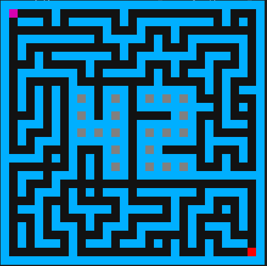
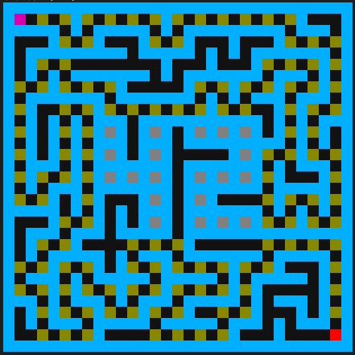
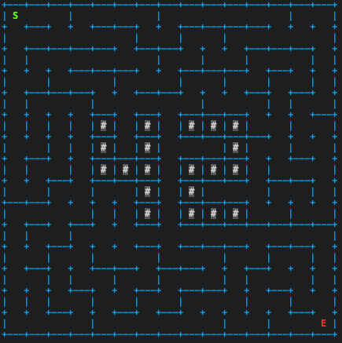
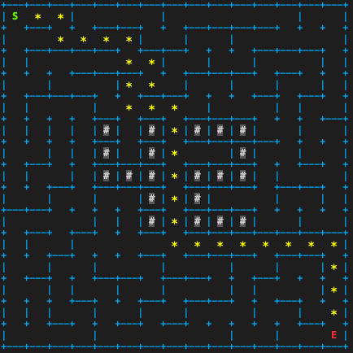

*This project has been created as part of the 42 curriculum by jakoch, jhimmero.*

## Contents

- [Description](#description)
- [Instructions](#instructions)
  - [Menu](#menu)
- [Example output](#example-output)
  - [Default board, colour blocks (`PERFECT=false`)](#default-board-colour-blocks-perfectfalse)
  - [Perfect maze, path revealed (`PERFECT=true`)](#perfect-maze-path-revealed-perfecttrue)
  - [ASCII renderer (`RENDERER=ascii`)](#ascii-renderer-rendererascii)
  - [ASCII with the path revealed](#ascii-with-the-path-revealed)
- [Configuration file](#configuration-file)
  - [Mandatory keys](#mandatory-keys)
  - [Optional keys](#optional-keys)
  - [Unknown keys are rejected](#unknown-keys-are-rejected)
  - [Example](#example)
- [Output file](#output-file)
- [Checking the output file](#checking-the-output-file)
  - [The rehearsal harness](#the-rehearsal-harness)
- [Error handling](#error-handling)
- [Chosen algorithm](#chosen-algorithm)
- [How the engine is put together](#how-the-engine-is-put-together)
- [Maze generation (eval answers)](#maze-generation-eval-answers)
  - [Random and seed](#random-and-seed)
  - [Bad parameters](#bad-parameters)
  - [Reachability, outer walls, coherence](#reachability-outer-walls-coherence)
  - [The 3x3 rule](#the-3x3-rule)
  - [The 42 pattern](#the-42-pattern)
  - [PERFECT vs Pac-Man](#perfect-vs-pac-man)
  - [How we check both modes](#how-we-check-both-modes)
- [Reusable module](#reusable-module)
  - [Rebuild the package (eval, two virtualenvs)](#rebuild-the-package-eval-two-virtualenvs)
  - [Instantiate and generate](#instantiate-and-generate)
  - [Parameters](#parameters)
  - [Structure and solution](#structure-and-solution)
  - [Errors](#errors-all-subclass-mazegenerror)
  - [Why MIT](#why-mit)
- [Resources](#resources)
  - [How AI was used](#how-ai-was-used)
- [Team and project management](#team-and-project-management)

## Description

A-Maze-ing generates a random maze, solves it, displays it in the
terminal and writes it to a file. It is split in two: a reusable,
pip-installable generator package (`mazegen`) and an application layer
(`a_maze_ing.py` + `app/`) that reads the configuration, renders the
result and drives the menu.

The maze is either *perfect* (exactly one route between any two cells)
or a *Pac-Man board* (fully connected, several independent routes, few
or no dead-ends). A "42" is drawn into the maze with fully closed
cells.

## Instructions

Requires Python 3.10 or newer. A virtual environment is recommended.

```
python3 -m venv .venv && source .venv/bin/activate
make install                 # installs mazegen (editable) + dev tools
make run                     # python3 a_maze_ing.py config.txt
```

The program takes exactly one argument, the config file:

```
python3 a_maze_ing.py config.txt
```

Other targets:

| Target | Does |
|---|---|
| `make install` | `pip install -e .` plus `requirements-dev.txt` |
| `make run` | runs against `config.txt` |
| `make debug` | the same, under `pdb` |
| `make clean` | removes `__pycache__`, `build`, `dist`, `.mypy_cache` |
| `make lint` | `flake8 .` and `mypy .` with the subject's flags |
| `make lint-strict` | `flake8 .` and `mypy . --strict` |

`requirements-dev.txt` pins flake8 and mypy exactly, so a fresh clone
lints with the same versions rather than whatever is newest.

The Git root must contain `README.md`, `LICENSE.md`, `a_maze_ing.py`,
`config.txt`, `mazegen-*.whl` (or `.tar.gz`), and `pyproject.toml` so
the package can be rebuilt. `make lint` must pass on the Python files.

The live rebuild (one venv to build, a second venv to install the
wheel, `PYTHONPATH` unset) is spelled out under
[Rebuild the package](#rebuild-the-package-eval-two-virtualenvs).

### Menu

| Key | Action |
|---|---|
| 1 | generate a new maze |
| 2 | show / hide the shortest path |
| 3 | change the wall colour |
| 4 | quit |

The path starts hidden. Menu key `2` shows it. If `ANIMATION_DELAY` is
set and stdout is a terminal, the path is drawn one step at a time
before the full board. Any other input prints a short hint and asks
again. Ctrl-D and Ctrl-C both quit cleanly.

## Example output

Four runs of the same program. The `config.txt` behind each picture is
printed above it, so the settings that produced it are visible rather than
implied.

### Default board, colour blocks (`PERFECT=false`)

The default mode, and what a terminal shows: fully connected, several
independent routes and no dead-ends, so the board is directly usable by a
Pac-Man-style game. The grey cells are the "42". Fully closed, and the
only cells allowed to be unreachable. Magenta marks the entry, red the
exit.

```
WIDTH=15
HEIGHT=15
ENTRY=0,0
EXIT=14,14
OUTPUT_FILE=maze.txt
PERFECT=false
SEED=42
```



### Perfect maze, path revealed (`PERFECT=true`)

With `PERFECT=true` there is exactly one route between any two cells and
no loops at all, so the shortest path is the only path, which is why it
winds through nearly the whole maze. Revealed with menu key `2`; it starts
hidden.

```
WIDTH=15
HEIGHT=15
ENTRY=0,0
EXIT=14,14
OUTPUT_FILE=maze.txt
PERFECT=true
SEED=42
```



### ASCII renderer (`RENDERER=ascii`)

`S` is the entry, `E` the exit, and `#` the cells forming the "42". Walls
are drawn as `+`, `-` and `|`.

This is also what redirected or piped output looks like, minus the colour:
when stdout is not a terminal the program falls back to ASCII and emits no
escape sequences at all, whatever `RENDERER` says.

```
WIDTH=15
HEIGHT=15
ENTRY=0,0
EXIT=14,14
OUTPUT_FILE=maze.txt
PERFECT=false
SEED=42
RENDERER=ascii
```



### ASCII with the path revealed

The same run after pressing `2`. The shortest path from `S` to `E` is
drawn as `*`, and it is the same path written to the output file. Both
come from a single call to the engine's solver, so they cannot disagree.



**Not every maze size can fit the "42".** The glyph is 7x5 cells and the
maze's centre has to stay open for it to sit beside, so a maze can be big
enough by area and still have nowhere to put it: 9x9 fits it, 10x10 does
not, 11x11 does again. When it cannot be placed it is simply left out and
a `[PATTERN_ERROR]` notice is printed on stderr, as the subject allows.
The program carries on normally and exits 0.

## Configuration file

One `KEY=VALUE` per line. Blank lines and lines starting with `#` are
ignored, surrounding spaces are stripped, and key names are
case-insensitive (`width=15` works). Values are not: paths keep their
case.

### Mandatory keys

| Key | Format | Example | Meaning |
|---|---|---|---|
| `WIDTH` | integer | `15` | maze width in cells |
| `HEIGHT` | integer | `15` | maze height in cells |
| `ENTRY` | `x,y` | `0,0` | entry cell |
| `EXIT` | `x,y` | `14,14` | exit cell |
| `OUTPUT_FILE` | path | `maze.txt` | where the maze is written |
| `PERFECT` | `true` / `false`, case-insensitive | `false` | perfect maze, or Pac-Man board |

### Optional keys

| Key | Format | Default | Meaning |
|---|---|---|---|
| `SEED` | integer | none (random) | same seed, same maze |
| `RENDERER` | `blocks` / `ascii` | `blocks` | preferred display style |
| `ANIMATION_DELAY` | integer milliseconds | on | path reveal speed; `0` turns animation off |

`RENDERER` is a preference, not a guarantee. Coloured blocks are used
only when stdout is a terminal, `NO_COLOR` is unset and `TERM` is not
`dumb`; otherwise the output is plain ASCII with no escape sequences,
so redirecting to a file always produces something readable.

`ANIMATION_DELAY` is also a preference: animation only runs when
showing the path, on a real terminal. Piped or redirected output skips
it.

### Unknown keys are rejected

A key that is neither mandatory nor optional is an error, not a
warning. A typo in an optional key would otherwise be invisible.
`SED=42` would silently run with a random seed while looking
reproducible. The cost is that adding a key means registering it in
`app/config.py`.

### Example

```
WIDTH=15
HEIGHT=15
ENTRY=0,0
EXIT=14,14
OUTPUT_FILE=maze.txt
PERFECT=false
# SEED=42
# RENDERER=ascii
# ANIMATION_DELAY=30
```

## Output file

`HEIGHT` lines of `WIDTH` hexadecimal digits, one digit per cell,
encoding that cell's walls (bit 0 = North, 1 = East, 2 = South,
3 = West; a set bit means the wall is closed). Then a blank line, then
three lines: the entry as `x,y`, the exit as `x,y`, and the shortest
path as direction letters **separated by single spaces**, e.g.
`E E S E S S`. Every line ends with `\n`.

The file always describes the maze currently generated. Hiding the
path on screen does not remove it from the file. The subject requires
it to be there.

## Checking the output file

The subject ships `maze_analyzer.py`, which reads an output file and reports
whether the wall encoding is coherent and whether the maze matches the mode
its config asked for:

```
python3 tools/maze_analyzer.py maze.txt
```

With the default board (`PERFECT=false`, 15x15, `SEED=42`):

```
Maze size        : 15 x 15 (225 cells)
Entry            : (0, 0)   Exit: (14, 14) (reachable)
Reachable region : 205 cells (0 corridor(s) unreachable)
Independent loops: 23 / 154 possible (path ratio 15%)
Dead-ends        : 0 real + 3 enclosed by the '42' (tolerated)
Corners + centre : all reachable
Wall coherence   : OK (all shared walls match)

Verdict: Pac-Man-USABLE: fully connected, corners and centre reachable, 23 independent routes; no real dead-end -> bonus-grade (perfectly braided).
```

Zero real dead-ends means the board is *perfectly braided*: a chased player
is never trapped anywhere. The subject lists that as a bonus in its own
right, checkable with:

```
python3 tools/maze_analyzer.py maze.txt --max-dead-ends 0
```

The same settings with `PERFECT=true`:

```
Maze size        : 15 x 15 (225 cells)
Entry            : (0, 0)   Exit: (14, 14) (reachable)
Reachable region : 205 cells (0 corridor(s) unreachable)
Independent loops: 0 / 154 possible (path ratio 0%)
Dead-ends        : 23 real + 3 enclosed by the '42' (tolerated)
Corners + centre : all reachable
Wall coherence   : OK (all shared walls match)

Verdict: PERFECT maze: a single path, no loop -> matches PERFECT=True (this is not a multi-route board for Pac-Man).
```

The 23 dead-ends there are not a fault: a perfect maze has exactly one route
between any two cells, so every branch that is not on that route has to end
somewhere. Zero loops is the defining property, and it is what the verdict
keys on. The three dead-ends "enclosed by the '42'" are the glyph's own
closed cells, which the subject explicitly permits.

One limitation worth knowing: **the analyzer never reads the solution path
line.** It parses the entry and exit from the footer and discards the path,
so a clean report says nothing about whether the path is correct or
shortest. That check is done separately by the rehearsal harness in
`not_for_submission/`.

### The rehearsal harness

The gap above (the analyzer discards the path line) is covered by a
separate script, `not_for_submission/b8_rehearsal.py`:

```
python3 not_for_submission/b8_rehearsal.py
```

It replays the evaluation scale before an evaluator does, in two groups.
The first sabotages `config.txt` seven ways and checks that every run dies
cleanly: exit code 1, one message, no traceback, and no output file left
behind. The second generates both `PERFECT` modes on three seeds each and
checks the resulting output file. That its path can actually be walked
without crossing a wall, that it ends on the exit, that it is genuinely the
shortest route, and that it matches the `*` drawn on screen. Then it runs
`maze_analyzer.py` over it.

Every check is `PASS`, `WARN` or `FAIL`. **FAIL** means the evaluation scale
would mark that question failed. **WARN** means the scale still passes and
only our own convention is unmet, such as an error message not naming the
key at fault. The script exits 1 if anything failed, so it can gate a push.

It is **not part of the submission**. It is written by Claude (see
[How AI was used](#how-ai-was-used)), lives outside the shipped code, and
nothing that ships imports it.

A clean run ends with:

```
======================================================================
RESULT: PASS  50 pass  0 warn  0 fail
======================================================================
```

The check nothing else makes is `length == independent BFS`: the harness
runs its own breadth-first search over the grid it reads back from the
file and compares the two lengths. It deliberately does not reuse the
application's own path code. A checker that shares code with the thing it
checks shares its bugs.

## Error handling

Every message that stops the program is a single line on stderr with a
category prefix, and the exit code is 1. No traceback ever reaches the
terminal.

| Prefix | Cause |
|---|---|
| `[USAGE_ERROR]` | wrong number of arguments |
| `[CONFIG_ERROR]` | config missing, unreadable, malformed or invalid |
| `[MAZE_ERROR]` | the generator rejected the parameters or failed |
| `[OUTPUT_ERROR]` | the output file could not be written |
| `[RENDER_ERROR]` | the engine returned data that cannot be drawn |
| `[INTERNAL_ERROR]` | last-resort backstop; a bug, not user input |

Two deliberate exceptions:

- `[PATTERN_ERROR]`: the maze is too small for the "42". The subject
  allows omitting it as long as a message is printed, so this goes to
  stderr and the program continues with exit code 0. It is a notice,
  not a failure.
- An unrecognised menu key prints a plain hint on stdout, with no
  prefix and no error exit. It is interactive feedback rather than a
  fault, and prefixing it would dilute the convention.

## Chosen algorithm

The generator uses **recursive backtracking**, but with an explicit
stack rather than real Python recursion.

How it builds a maze, in plain language:

1. You stand in a cell. Every wall is closed.
2. You look at the neighbours you have never visited.
3. You pick one at random, knock down the wall between you, and walk
   into it.
4. Dead end? You step back along the notes you kept (the stack) and
   try a different neighbour.
5. Repeat until every cell has been visited.

That is the carve step. After this pass the maze is *perfect*: exactly
one path between any two cells, no loops.

Why this algorithm, and why a stack:

- A perfect maze falls out of the method itself. You do not have to
  repair loops afterwards.
- Defence can ask for 200x200. Real recursion would hit
  `RecursionError`. A list used as a stack does not.
- With a `seed`, the random choices are replayable, so the same config
  always rebuilds the same maze.

Pac-Man mode (`PERFECT=false`, the default) starts from that same
perfect maze and then braids it: extra walls come down at dead ends,
and the four corners plus the centre are forced open. The subject wants
several independent routes, not "a perfect maze with one wall missing".

If you want to see the idea move rather than read about it:

- Building (recursive backtracker, live animation):
  https://www.youtube.com/watch?v=KWeeTMwFA9Y
- The article most explanations copy from (pictures, very readable):
  https://weblog.jamisbuck.org/2010/12/27/maze-generation-recursive-backtracking
- Same idea as text / pseudocode:
  https://en.wikipedia.org/wiki/Maze_generation_algorithm#Recursive_backtracker
- Solving (BFS, shortest path):
  https://www.youtube.com/watch?v=xlVX7dXLS64
  https://www.youtube.com/watch?v=5MwMPklN6PA

## How the engine is put together

Nothing here is a second algorithm. It is the same generator, built in
layers so each rule has one place to live.

| Step | What it actually does | Builds a maze? | Solves a maze? |
| --- | --- | --- | --- |
| Skeleton | Empty module + error types + a fake 5x5 so the app could start | No (stub) | No |
| Tools | Grid of closed cells, `_open_wall`, hex dump (`to_rows`) | No (tools only) | No |
| Carve | Recursive backtracker on an explicit stack | **Yes** | No |
| Solve | BFS from entry to exit | No | **Yes** (shortest path) |
| "42" | Stamp fully closed cells *before* the carve runs | Only those cells stay sealed | No |
| Braid | If not perfect: open dead ends, then corners + centre | Extra openings | No |
| 3x3 check | Before any extra opening, refuse it if it would make a 3x3 hall | Constraint | No |
| Validate | Reject impossible sizes and coordinates | No | No |

**Walls stay honest.** A cell is a number 0..15. Bit 0 = North, 1 = East,
2 = South, 3 = West. A set bit means that wall is closed. When
`_open_wall` knocks down the east wall of cell A, it also knocks down
the west wall of cell B. One function, both sides. The outer border
has no neighbour, so those walls stay closed.

**The solver is BFS, not DFS.** Waves spread from the entry. The first
time a wave hits the exit, that route is the shortest. Result is a list
of letters like `["E", "E", "S"]`. The app calls this once and uses it
for both the file and the screen, so the two cannot disagree.

**The "42"** is a 7x5 stamp of fully closed cells, placed as close as
possible to the middle of the maze. It must not sit on the entry, the
exit, a corner, or every centre cell (Pac-Man needs at least one centre
cell as a corridor). If the maze is too small to fit that without
breaking those rules, the pattern is left out and `has_pattern` is
`False`. The engine does not print. The app prints `[PATTERN_ERROR]`.

**The 3x3 rule.** Corridors may be 2 cells wide. A 3x3 block of open
cells is forbidden. The check runs before a wall is opened, not as a
cleanup pass: try the opening, look at every 3x3 window that touches
that cell, restore the wall if any window would be fully open.

The engine never prints. Bad input raises a `MazegenError` subclass.
The app catches that and turns it into one line on stderr.

## Maze generation (eval answers)

These are the maze-generator questions on the scale sheet, in the same
order, with how we meet them.

### Random and seed

Generation uses Python's `random.Random`. `generate()` re-seeds at the
start, so the same `SEED` always rebuilds the same maze. Leave `SEED`
commented out for a new maze on every run, including menu key `1`.

### Bad parameters

`MazeGenerator.__init__` calls `_validate()` before any grid exists:

- width or height below 2 (including negatives and 1xN strips) raises
  `InvalidDimensionError`
- entry equal to exit, or a coordinate outside the grid, raises
  `InvalidCoordinateError`

Python would treat `ENTRY=-1,0` as the last cell of the row. We reject
that up front. The engine does not print. The app prints one
`[MAZE_ERROR]` line and exits 1.

### Reachability, outer walls, coherence

After generation, every corridor is reachable from the entry. The only
cells that may be unreachable are the fully closed "42" cells, which
the subject allows.

The outer border never opens: `_open_wall` looks for a neighbour, and
if there is none it returns without clearing the bit. That is "walls
all around the maze".

Shared walls always match. Opening east on cell A also opens west on
cell B, in the same function. `maze_analyzer.py` reports
`Wall coherence : OK` when that holds.

### The 3x3 rule

Corridors may be two cells wide. A 3x3 block of cells with every
internal wall gone is forbidden. The eval asks how this was
implemented or verified, so here is the actual method.

It is not a cleanup pass at the end. `_try_open` calls
`_creates_open_3x3` *before* a wall stays open:

1. Remember the two cells' old values.
2. Open the wall (both sides).
3. Scan every 3x3 window in the grid (`_has_open_3x3`).
4. Restore the two cells.
5. If any window was fully open, refuse that wall. Otherwise open it
   for real.

`_block_is_open_3x3` only looks at internal east and south walls of
the nine cells. Outer walls of the window are the edge of the hall,
not the inside.

This runs on every extra opening in Pac-Man mode (`_braid` and
`_open_key_cells`). The perfect-maze carve never creates a 3x3 hall,
because it only knocks down the wall into an *unvisited* cell.

### The 42 pattern

The glyph is 7x5 fully closed cells (a "4", a one-cell gap, a "2").
It is stamped *before* the carve, and those cells are marked visited,
so the backtracker walks around them.

It must not cover the entry, the exit, a corner, or *every* centre
cell (Pac-Man's start). On even sizes the analyser treats a 2x2 as
"the centre"; keeping one of those four as a corridor is enough, so
the glyph can still sit in the middle.

If the maze is too small to place it under those rules, we skip it.
`has_pattern` is `False`. The engine stays silent. The app prints
`[PATTERN_ERROR]` on stderr and continues with exit code 0, which is
what the subject asks for.

### PERFECT vs Pac-Man

Both modes start the same way: stamp the 42, then carve a perfect
maze.

**`PERFECT=true`.** Stop there. Exactly one path between any two
corridor cells, no loops. `maze_analyzer.py` must say `PERFECT maze`.
Dead-ends are expected: every branch that is not on the unique path
has to end somewhere.

**`PERFECT=false` (the default).** After the carve, `_braid` opens
dead-ends (each opening still goes through the 3x3 check), then
`_open_key_cells` gives the four corners and the centre a second
exit when that is legal. Result: full connectivity, corners and
centre are corridors, at least two independent routes. A couple of
real dead-ends are tolerated. Zero real dead-ends is the braided
bonus; check with `--max-dead-ends 0`. A perfect maze with one wall
pulled down is not enough, and we do not do that.

### How we check both modes

```
python3 tools/maze_analyzer.py maze.txt
```

Generate once with `PERFECT=true` and once with `PERFECT=false`. The
script must report `PERFECT maze` for the first and `Pac-Man-USABLE`
for the second. It also checks wall coherence, that corners and centre
are reachable, and the loop / dead-end counts.

The analyser does *not* read the path line in the file. The file path
and the `*` on screen both come from one `solve()` call (BFS). The
rehearsal harness in `not_for_submission/` walks the file path and
compares its length to an independent BFS.

## Reusable module

`mazegen` is a normal pip package. The class you import is
`MazeGenerator`. Internals do not have to look like the output file.
`to_rows()` and `solve()` are what you write to disk.

The same short documentation lives in `docs/readme_engine.md`.

### Rebuild the package (eval, two virtualenvs)

The scale sheet asks you to rebuild the package in one virtualenv,
then install that new file in a *different* virtualenv, then run
`a_maze_ing.py`. Do not use `pip install -e .` for that test. Editable
install still points at `src/`, so you would not be testing the wheel.

Unset `PYTHONPATH` if it contains `src`. Otherwise `import mazegen`
picks up the live tree and the wheel was never used.

```
# virtualenv 1: rebuild
python3 -m venv /tmp/mazegen-build
source /tmp/mazegen-build/bin/activate
pip install build
python3 -m build
deactivate

# virtualenv 2: install only the wheel, then run the app
python3 -m venv /tmp/mazegen-run
source /tmp/mazegen-run/bin/activate
unset PYTHONPATH
pip install dist/mazegen-1.0.0-py3-none-any.whl
pip list
# mazegen must appear with no path after it. A path means an
# editable install, so the wheel was never tested.
python3 -c "import mazegen; print(mazegen.__file__)"
# that path must be .../site-packages/mazegen/..., not this repo's src/
python3 a_maze_ing.py config.txt
```

`make clean` deletes `dist/`. It does not delete the wheel in the
repo root. That root copy is the one git tracks.

During day-to-day work, `make install` (`pip install -e .`) is fine.

### Instantiate and generate

```python
from mazegen import MazeGenerator

maze = MazeGenerator(
    width=15,
    height=15,
    entry=(0, 0),
    exit=(14, 14),
    perfect=False,
    seed=42,
)
maze.generate()
```

### Parameters

| Parameter | Meaning |
| --- | --- |
| `width`, `height` | Size in cells. Both must be at least 2. |
| `entry`, `exit` | `(x, y)` with `(0, 0)` in the top-left. Must differ, must sit inside the grid. |
| `perfect` | `True`: one path, no loops. `False` (default): Pac-Man board, several routes. |
| `seed` | Optional int. Same seed, same maze. `None` means a fresh maze each call. |
| `algorithm` | Reserved. Currently only `"backtracker"`. |

### Structure and solution

```python
# Hex rows, one character per cell (the output-file encoding).
rows = maze.to_rows()

# Same data as integers 0..15. grid[y][x].
cell = maze.grid[0][0]

# Shortest path as direction letters.
path = maze.solve()          # e.g. ["E", "S", "E"]

# The "42" cells, or empty if the maze was too small.
maze.has_pattern             # bool
maze.pattern_cells           # frozenset of (x, y)
```

If the maze is 5x5, `generate()` still succeeds, but `has_pattern` is
`False` and `pattern_cells` is empty. That is allowed. Do not treat it
as a crash.

### Errors (all subclass `MazegenError`)

| Exception | Typical cause |
| --- | --- |
| `InvalidDimensionError` | width or height below 2 |
| `InvalidCoordinateError` | entry equals exit, or a coordinate outside the grid |
| `NoSolutionError` | `solve()` could not reach the exit (should not happen after a successful `generate`) |
| `ImpossibleMazeError` | reserved for a maze that cannot be built |

Catch `MazegenError` if you only care that the engine refused. Catch
the subclass if you want to tell the kinds apart.

### Why MIT

`LICENSE.md` is the MIT license. The subject (and the later Pac-Man
project) require a license that explicitly allows reuse and
redistribution of the maze generator. MIT says that in one short page:
anyone may use, copy, modify, merge, publish, distribute, sublicense,
and sell the software, as long as the copyright notice stays with it.
There is no copyleft, so a later game can ship the engine without
opening the rest of the game. That is the pedagogical point of
`LICENSE.md`, not a decoration.

## Resources

- Subject and `maze_analyzer.py`, 42 intra.
- Jamis Buck, Maze Generation: Recursive Backtracking:
  https://weblog.jamisbuck.org/2010/12/27/maze-generation-recursive-backtracking
- Recursive backtracker, animated:
  https://www.youtube.com/watch?v=KWeeTMwFA9Y
- BFS visually:
  https://www.youtube.com/watch?v=xlVX7dXLS64
  https://www.youtube.com/watch?v=5MwMPklN6PA
- Python documentation
- <https://no-color.org/>, the `NO_COLOR` convention.
- ANSI 256-colour codes, for the wall palette.

### How AI was used

- **`not_for_submission/b8_rehearsal.py` was written by Claude
  (Anthropic)** and is the only file in the repository authored by AI
  as a whole. It is a test harness: it replays the evaluation scale's
  config sabotages and checks the output file's solution path against an
  independent breadth-first search and against the rendered maze. It is
  not submitted, nothing that ships imports it, and its module
  docstring states this.
- Claude was also used for review and explanation of the application
  layer (arguing through design decisions, reproducing failures and
  checking output) but did not write the submitted application source.
- Cursor was used on the engine side for implementation help and
  explanations: wall encoding, the backtracker, BFS, the "42" stamp
  (including placing it on even sizes), the 3x3 check while braiding,
  parameter validation, MIT + the wheel, and this README. The submitted
  generator is ours to explain. We can walk through `_open_wall`,
  `_carve`, `_creates_open_3x3` and `solve()` without the tool.

## Team and project management

**Roles.** jhimmero owns the engine (`src/mazegen/**`, `pyproject.toml`,
`LICENSE.md`, the wheel). jakoch owns the application (`a_maze_ing.py`,
`app/**`, `config.txt`, `Makefile`). The seam is the frozen contract in
`INTERFACE.md`: B never reimplements BFS, and the only exceptions the
app is allowed to see are `MazegenError` subclasses.

**How we planned.** We split by that seam on day 0, not by "features".
A shipped a stub generator first so B could build config, display and
menu against the real function names. After that, one branch per task,
reviewed by the other person. Neither of us edits the other person's
files. Need a change on the other side? Ask.

**What worked.** The stub plus the analyzer. If the output file is
wrong, `tools/maze_analyzer.py` says so before anyone squints at
hex digits. The 3x3 rule only stayed true because the check sits
inside the opening loop, not after.

**What we would do differently.** Test the wheel in a second venv with
`PYTHONPATH` unset earlier. From the repo directory, `src/` is easy to
import by accident, and then you think the wheel works when you are
still running the live tree. Also, the "42" on even widths: forbidding
the whole 2x2 centre pushed the glyph off to the side. One open centre
cell is enough, and then it sits in the middle.

**Tools.** GitHub PRs, `flake8`, `mypy` (including `--strict`),
`maze_analyzer.py`, a Makefile with `install` / `run` / `debug` /
`clean` / `lint` / `lint-strict`.
